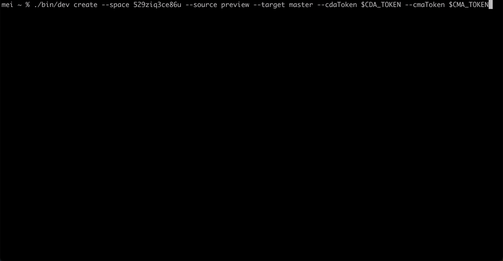

<!-- header  START -->

<p align="center">
  <a href="https://www.contentful.com/developers/docs/">
    
  </a>
</p>

<h1 align='center'>Contentful Merge</h1>

<p align="center">
  <a href="#introduction">Introduction</a> |
  <a href="#features">Features</a> |
  <a href="#installation">Installation</a> |
  <a href="#usage">Usage</a> |
  <a href="#commands">Commands</a> |
  <a href="#data-structure">Data structure</a> |
  <a href="#faq">FAQ</a> |
  <a href="#feedback">Feedback</a> |
  <a href="#code-of-conduct">Code of Conduct</a> |
  <a href="#license">License</a>
</p>

<p align="center">
  <a href="https://oclif.io">
    
  </a>
  <a href="https://www.npmjs.com/package/contentful-merge">
    
  </a>
  <a href="https://circleci.com/gh/contentful/contentful-merge/?branch=main">
    
  </a>

</p>

<!-- header  END -->

## Introduction

**Contentful**

[Contentful](https://www.contentful.com/) provides content infrastructure for digital teams to power websites, apps, and devices. It offers a central hub for structured content, powerful management and delivery APIs, and a customizable web app that enables developers and content creators to ship their products faster.

**Contentful Merge**

The <b>contentful-merge</b> CLI tool allows you to compare and merge entries across environments in a Contentful space. It can be used to create a changeset of all entry differences between two environments, and to apply this changeset to another environment, thereby effectively syncing the content of two environments.



### Tracking

- We want to know how people are using this tool, so that we can prioritize what to focus on next. We therefore collect some [analytics](src/analytics/index.ts) data.
- <b>We would love your feedback!</b> [Here](https://forms.gle/uVj4sG2jKmQHotRd6) is a form where you can tell us about your experience and let us know which additional features you would like.

---

## Features

Takes a space id and two environment ids and creates a changeset which details all entry differences between the two environments.

- It uses the [Contentful Delivery API](https://www.contentful.com/developers/docs/references/content-delivery-api/) (CDA) to fetch all data.
- A custom CDA client executes requests in the different environments in parallel.
- All requests are batched.
- In order to identify <b>added</b> and <b>deleted</b> entries, entry ids are compared in both environments.
- In order to identify <b>updated</b> entries, comparison happens in two steps:
  The initial step involves identifying potentially diverging entries by examining the `sys.changedAt` property of all entries present in both environments.
  Subsequently, for all entries with distinct `sys.changedAt` values, a more comprehensive comparison of their payload is performed. If any variations are found, a patch is generated to reflect the differences.

> <b>:bulb: Want to merge content types instead of entries? :bulb:</b>
> We got you covered: Take a look at the [Merge App](https://www.contentful.com/marketplace/app/merge/) to your space, or, if you prefer the command line, check out the [Merge CLI](https://github.com/contentful/contentful-cli/tree/master/docs/merge).

## Installation

Prerequisite: node v18

```bash
npm install -g contentful-merge
```

## Usage

```sh-session
$ npm install -g contentful-merge
$ contentful-merge COMMAND
running command...
$ contentful-merge (--version)
contentful-merge/0.0.0 darwin-arm64 node-v20.2.0
$ contentful-merge --help [COMMAND]
USAGE
  $ contentful-merge COMMAND
...
```

## Commands

- [`contentful-merge create`](#contentful-merge-create)
- [`contentful-merge apply`](#contentful-merge-apply)
- [`contentful-merge help [COMMANDS]`](#contentful-merge-help-commands)

#### `contentful-merge create`

```
Create Entries Changeset

USAGE
  $ contentful-merge create --space <value> --source <value> --target <value> --cda-token <value> [--request-batch-size <value>] [--output-file <value>] [--query-entries <value>] [--allowed-operations <value>]

FLAGS
  --cda-token=<value>           (required) CDA token, defaults to env: $CDA_TOKEN
  --host=<value>                [default: api.contentful.com] Contentful API host
  --query-entries=<value>       Query parameters for entries based on CDA. You can pass multiple query-entries flags.
  --allowed-operations=<value>  [default: add,delete,update] Allowed operations for changeset. You can pass multiple allowed-operations flags.
  --output-file=<value>         File path to changeset file
  --request-batch-size=<value>  [default: 1000] Limit for every single request
  --source=<value>              (required) Source environment id
  --space=<value>               (required) Space id
  --target=<value>              (required) Target environment id

DESCRIPTION
  Create Entries Changeset

EXAMPLES
  $ contentful-merge create --space "<space id>" --source "<source environment id>" --target "<target environment id>" --cda-token <cda token> --output-file <output file path> --query-entries "content_type=<content_type_id>" --query-entries "sys.id=<entry_id>" --allowed-operations=add --allowed-operations=delete
```

#### `contentful-merge apply`

```
Apply Changeset

USAGE
  $ contentful-merge apply --space <value> --environment <value> --cma-token <value> --file <value> [--yes]

FLAGS
  --cma-token=<value>    (required) CMA token, defaults to env: $CMA_TOKEN
  --host=<value>                [default: api.contentful.com] Contentful API host
  --environment=<value>  (required) Target environment id
  --file=<value>         (required) File path to changeset file
  --space=<value>        (required) Space id
  --yes                  Skips any confirmation before applying the changeset

DESCRIPTION
  Apply Changeset

EXAMPLES
  $ contentful-merge apply  --space "<space-id>" --environment "staging" --file changeset.json

  $ contentful-merge apply  --space "<space-id>" --environment "staging" --file changeset.json --yes
```

#### `contentful-merge help [COMMANDS]`

Display help for contentful-merge.

```
Contentful CLI to diff and merge entries across environments

VERSION
  contentful-merge/0.0.0 darwin-arm64 node-v18.14.0

USAGE
  $ contentful-merge [COMMAND]

COMMANDS
  apply   Apply Changeset
  create  Create Entries Changeset
  help    Display help for contentful-merge.
```

## Data structure

The created changeset will be saved in JSON format in a file specified with the output-file flag or if the flag is not provided in a file called `changeset-[DATE]-[SPACE]-[SOURCE]-[TARGET].json`. It has the following basic structure:

```javascript
{
  "sys": {
    "type": "Changeset",
    "createdAt": "<date of changeset creation>",
    "space": {
      "sys": {
        "id": "<space id>",
        "linkType": "Space",
        "type": "Link"
      }
    },
    "source": {
      "sys": {
        "id": "<source environment id>",
        "linkType": "Environment",
        "type": "Link"
      }
    },
    "target": {
      "sys": {
        "id": "<target environment id>",
        "linkType": "Environment",
        "type": "Link"
      }
    }
  },
  "items": [
    // <individual changeset items, see below>
  ]
}
```

The actual changes are in the `items` array. They have the following structure:

```javascript
// delete
{
  "changeType": "delete",
  "entity": {
    "sys": {
      "type": "Link",
      "linkType": "Entry",
      "id": "5mgMoU9aCWE88SIqSIMGYE"
    }
  }
}

// add
{
  "changeType": "add",
  "entity": {
    "sys": {
      "type": "Link",
      "linkType": "Entry",
      "id": "5mgMoU9aCWE88SIqSIMGYE"
    }
  },
  "data": {
    // <payload of added entry>
  }
}

// update
{
  "changeType": "update",
  "entity": {
    "sys": {
      "type": "Link",
      "linkType": "Entry",
      "id": "5mgMoU9aCWE88SIqSIMGYE"
    }
  },
  "patch": [
    // <individual patch operations for each change>
  ]
}
```

There are three different change types: `add`, `update`, `delete`.

- Changes of type `delete` include `changeType` and `entity`, as seen above.

- Changes of type `update` include an additional property `patch`, with an array of patch operations where content differs between environments.

- Changes of type `add` include an additional property `data` property with the usual Contentful entry payload.

If you want to see the data structure in practice, run the `create` command and have a look at the generated `changeset.json` file, or look at the [type definitions](src/engine/types.ts).

## Limitations

At the moment we have a [limit amount](./src/config.base.ts#L2) of entries that can be in the generated changeset

| Change Type | Limit  |
| ----------- | ------ |
| Add         | 10 000 |
| Delete      | 10 000 |
| Update      | 10 000 |
|             |        |
| Total       | 10 000 |

For apply command one can merge at most 10 000 changes at once.

Further limitations:

- Tags, Assets, Comments, Workflows and Tasks are not compared and are not copied from one environment to another.
- We only consider published entries during comparison, thus entries that are in draft state will not be compared.
- Entries when added are immediately published.
- Locales must be the same in the source and target environment.

## FAQ

**I have access to the environments I provided, yet the CLI responds with a 404, what could be wrong?**

Make sure your CDA token has access to both environments, otherwise the CDA may respond with a 404.

**I have made draft changes in my environment, but I don't see those in the changeset.**

As the CDA is used to fetch and compare entries, only published changes will be taken into account. Draft changes are not available via the CDA.

## Feedback

Want to report bugs, give feedback, request features?

- Found some bugs? Head over to https://support.contentful.com and open a support ticket.
- Want to request a feature or tell us your overall experience with this CLI? Feel free to use [this form](https://forms.gle/uVj4sG2jKmQHotRd6).

## Code of Conduct

We want to provide a safe, inclusive, welcoming, and harassment-free space and experience for all participants, regardless of gender identity and expression, sexual orientation, disability, physical appearance, socioeconomic status, body size, ethnicity, nationality, level of experience, age, religion (or lack thereof), or other identity markers. Read our full [Code of Conduct](https://www.contentful.com/developers/code-of-conduct/) here.

## License

This project is licensed under [MIT license](LICENSE).
