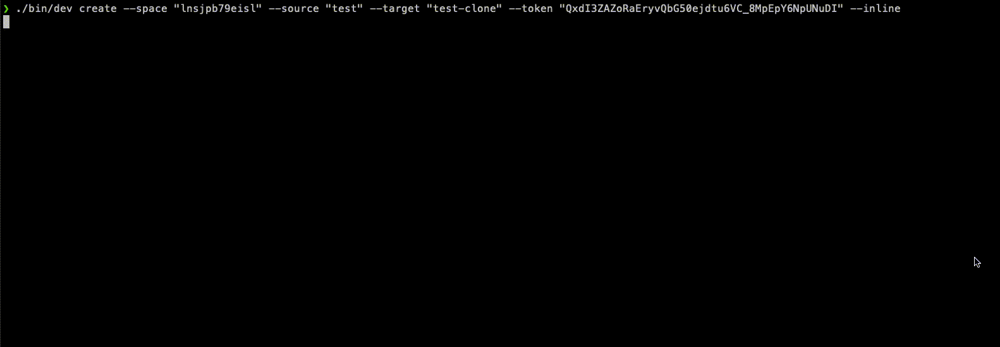

ccccli
=================

Content Changeset Creation CLI (POC)

[](https://oclif.io)
[](https://npmjs.org/package/oclif-hello-world)
[](https://circleci.com/gh/oclif/hello-world/tree/main)
[](https://npmjs.org/package/oclif-hello-world)
[](https://github.com/oclif/hello-world/blob/main/package.json)

### Proof of concept for content (`Entry`) Changeset creation. 
- Uses Contentful Delivery API to fetch all data (higher rate limits).
- Uses `auto` throttling to calculate max amount of possible requests per second.
- Custom CDA Client to execute requests on different environments in parallel. 
- Detects possibly diverged entities based on `sys.changedAt` property.
- Flexible output for `added` entries (`Link` to source entry or full entry payload)
- Batches all requests


> no worries, that token is revoked!

# Statistics

Identical environments
```
Created a new changeset for 2 environments with 2965 source entities and 2965 target entities.
The resulting changeset has 0 removed, 0 added and 0 changed entries.
0 entities were detected with a different sys.changedAt date, but were identical.
Overall 62 CDA and 0 CMA request were fired within 8.6 seconds.
```

Empty `target` environment (`Link`)
```
Created a new changeset for 2 environments with 2965 source entities and 0 target entities.
The resulting changeset has 0 removed, 2965 added and 0 changed entries.
0 entities were detected with a different sys.changedAt date, but were identical.
Overall 32 CDA and 0 CMA request were fired within 4.3 seconds.
```

Empty `target` environment (full payload)
```
Created a new changeset for 2 environments with 2965 source entities and 0 target entities.
The resulting changeset has 0 removed, 2965 added and 0 changed entries.
0 entities were detected with a different sys.changedAt date, but were identical.
Overall 62 CDA and 0 CMA request were fired within 16.1 seconds.
```

Empty `source` environment
```
Created a new changeset for 2 environments with 0 source entities and 2965 target entities.
The resulting changeset has 2965 removed, 0 added and 0 changed entries.
0 entities were detected with a different sys.changedAt date, but were identical.
Overall 32 CDA and 0 CMA request were fired within 4.4 seconds.
```

Diverged Environments with `199` changed entries
```
Created a new changeset for 2 environments with 2965 source entities and 2966 target entities.
The resulting changeset has 1 removed, 0 added and 199 changed entries.
0 entities were detected with a different sys.changedAt date, but were identical.
Overall 66 CDA and 0 CMA request were fired within 10.0 seconds.
```

### Next steps
- General
  - [ ] more entities (`Asset`, `EditorInterface`, `ContentType`)
  - [ ] more logging
- Create
  - [ ] use worker thread to compute ids
- Apply
  - [ ] Gracefully fail when change not applicable
  - [x] General result message
  - [ ] Apply ChangeSet to target environment, following the right order.

# Table of contents
<!-- toc -->
* [Statistics](#statistics)
* [Table of contents](#table-of-contents)
* [Usage](#usage)
* [Commands](#commands)
<!-- tocstop -->
# Usage
<!-- usage -->
```sh-session
$ npm install -g ccccli
$ ccccli COMMAND
running command...
$ ccccli (--version)
ccccli/0.0.0 darwin-x64 node-v16.15.1
$ ccccli --help [COMMAND]
USAGE
  $ ccccli COMMAND
...
```
<!-- usagestop -->
# Commands
<!-- commands -->
* [`ccccli create`](#ccccli-create)
* [`ccccli help [COMMAND]`](#ccccli-help-command)

## `ccccli create`

Create Entries Changeset

```
USAGE
  $ ccccli create --source <value> --target <value> --space <value> --token <value> [--inline]

FLAGS
  --inline          inline added entity payload
  --source=<value>  (required) source environment id
  --space=<value>   (required) space id
  --target=<value>  (required) target environment id
  --token=<value>   (required) cda token

DESCRIPTION
  Create Entries Changeset

EXAMPLES
  ./bin/dev create --space "<space-id>" --source "master>" --target "staging" --token "<cda-token>"

  $ ccccli create --space "<space-id>" --source "master" --target "staging" --token "<cda-token>"
```

_See code: [dist/commands/create/index.ts](https://github.com/marcolink/ccccli/blob/v0.0.0/dist/commands/create/index.ts)_

## `ccccli help [COMMAND]`

Display help for ccccli.

```
USAGE
  $ ccccli help [COMMAND] [-n]

ARGUMENTS
  COMMAND  Command to show help for.

FLAGS
  -n, --nested-commands  Include all nested commands in the output.

DESCRIPTION
  Display help for ccccli.
```

_See code: [@oclif/plugin-help](https://github.com/oclif/plugin-help/blob/v5.1.15/src/commands/help.ts)_
<!-- commandsstop -->

## FAQ / Gotchas
**My environments differ, yet the CLI responds with a 404, what could be wrong?**

Make sure your CDA (Content Delivery API) tokens have access to both environments, otherwise the CDA may respond with a 404.
