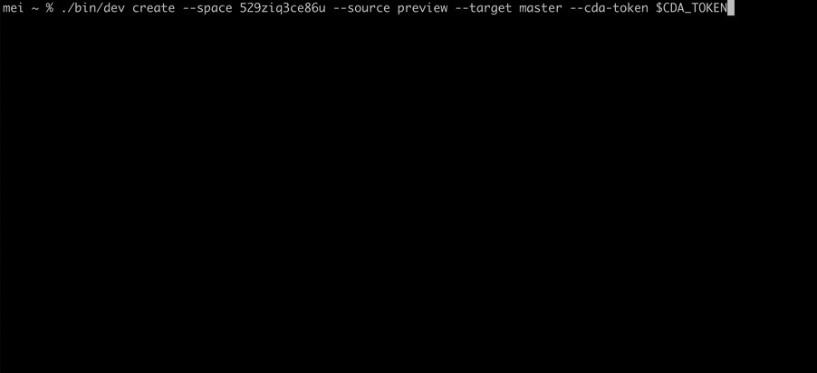

<!-- header  START -->

<p align="center">
  <a href="https://www.contentful.com/developers/docs/">
    
  </a>
</p>

<h1 align='center'>Contentful Merge</h1>

<!-- // TODO UPDATE -->
<p align="center">
  <a href="#introduction">Introduction</a> |
  <a href="#warning-this-project-is-still-in-beta-warning">Beta disclaimer</a> |
  <a href="#features">Features</a> |
  <a href="#installation">Installation</a> |
  <a href="#usage">Usage</a> |
  <a href="#commands">Commands</a> |
  <a href="#data-structure">Data structure</a> |
  <a href="#faq">FAQ</a> |
  <a href="#whats-next">What's next</a> |
  <a href="#feedback">Feedback</a> |
  <a href="#code-of-conduct">Code of Conduct</a> |
  <a href="#license">License</a>
</p>


<p align="center">
  <a href="https://oclif.io">
    
  </a>
  <a href="https://www.npmjs.com/package/contentful-merge">
    
  </a>
  <a href="https://circleci.com/gh/contentful/contentful-merge/?branch=main">
    
  </a>

</p>

<!-- header  END -->


## Introduction

**Contentful**

[Contentful](https://www.contentful.com/) provides content infrastructure for digital teams to power websites, apps, and devices. It offers a central hub for structured content, powerful management and delivery APIs, and a customizable web app that enables developers and content creators to ship their products faster.

**Contentful Merge**

The <b>contentful-merge</b> CLI tool lets you compare entries across environments. It tells you how many entries are in the source and target environments, and how many of those have been added, deleted or updated. A detailed changeset is saved in a file.



_____________________

### :warning: This project is still in beta :warning:
This means:
- Use at your own risk! It might still be a bit rough around the edges, and we might introduce breaking changes.
- We want to know how people are using this tool, so that we can prioritize what to focus on next. We therefore collect some [analytics](src/analytics/index.ts) data.
- <b>We would love your feedback!</b> [Here](<TODO-add-link-to-feedback-form>) is a form where you can tell us about your experience and let us know which additional features you would like.

_____________________

## Features

Takes a space id and two environment ids and creates a changest which details all entry changes between the two environments.
- It uses the [Contentful Delivery API](https://www.contentful.com/developers/docs/references/content-delivery-api/) (CDA) to fetch all data.
- A custom CDA client executes requests in the  different environments in parallel, using `auto` throttling to calculate the maximum amount of possible requests per second.
- All requests are batched.
- To identify <b>added</b> and <b>removed</b>, entry ids are compared in both environments.
- To identify <b>changed</b> entries, comparison happens in two steps:
  The initial step involves identifying potentially diverging entries by examining the `sys.changedAt` property of all entries present in both environments.
  Subsequently, for all entries with distinct `sys.changedAt` values, a more comprehensive comparison of their payload is performed. If any variations are found, a patch is generated to reflect the differences.

><b>:bulb: Want to merge content types instead of entries? :bulb:</b>
> We got you covered: Take a look at the [Merge App](https://www.contentful.com/marketplace/app/merge/) to your space, or, if you prefer the command line, check out the [Merge CLI](https://github.com/contentful/contentful-cli/tree/master/docs/merge).

## Installation

Prerequisite: node v18

```bash
npm install contentful-merge
```

## Usage

```sh-session
$ npm install -g contentful-merge
$ contentful-merge COMMAND
running command...
$ contentful-merge (--version)
contentful-merge/0.0.0 darwin-arm64 node-v20.2.0
$ contentful-merge --help [COMMAND]
USAGE
  $ contentful-merge COMMAND
...
```
## Commands
* [`contentful-merge create`](#contentful-merge-create)
* [`contentful-merge help [COMMANDS]`](#contentful-merge-help-commands)

#### `contentful-merge create`


```
Create Entries Changeset

USAGE
  $ contentful-merge create --space <value> --source <value> --target <value> --cdaToken <value> --cmaToken
    <value> [--limit <value>]

FLAGS
  --space=<value>     [required] Space id
  --source=<value>    [required] Source environment id
  --target=<value>    [required] Target environment id
  --cdaToken=<value>  [required] CDA token
  --cmaToken=<value>  [required] CMA token
  --limit=<value>     [default: 200] Limit parameter for collection endpoints

DESCRIPTION
  Create Entries Changeset

EXAMPLES
  $ contentful-merge create --space "<space id>" --source "<source environment id>" --target "<target environment id>" --cdaToken <cda token> --cmaToken <cma token>

  $ contentful-merge create --space "<space id>" --source "<source environment id>" --target "<target environment id>" --cdaToken <cda token> --cmaToken <cma token> --limit 100
```


#### `contentful-merge help [COMMANDS]`

Display help for contentful-merge.

```
Contentful CLI to diff and merge entries across environments

VERSION
  contentful-merge/0.0.0 darwin-arm64 node-v18.14.0

USAGE
  $ contentful-merge [COMMAND]

COMMANDS
  create  Create Entries Changeset
  help    Display help for contentful-merge.
```

## Data structure

> ⚠️ As this project is still in beta, the data structure might still change down the line ⚠️

The created changeset will be saved in JSON format in a file called `changeset.json` in the directory that you run the command in. It has the following basic structure: 
```
{
  "sys": {
    "type": "Changeset",
    "entityType": "Entry",
    "createdAt": "<date of changeset creation>",
    "version": 1,
    "source": {
      "sys": {
        "id": "<source environment id>",
        "linkType": "Environment",
        "type": "Link"
      }
    },
    "target": {
      "sys": {
        "id": "<target environment id>",
        "linkType": "Environment",
        "type": "Link"
      }
    }
  },
  "items": [
    <individual changeset items, see below>
  ]
}
```

The actual changes are in the `items` array. They have the following structure:
```
// deleted
{
  "changeType": "deleted",
  "entity": {
    "sys": {
      "type": "Link",
      "linkType": "Entry",
      "id": "5mgMoU9aCWE88SIqSIMGYE"
    }
  }

// added
{
  "changeType": "added",
  "entity": {
    "sys": {
      "type": "Link",
      "linkType": "Entry",
      "id": "5mgMoU9aCWE88SIqSIMGYE"
    }
  },
  "data": <payload of added entry>

// changed
{
  "changeType": "changed",
  "entity": {
    "sys": {
      "type": "Link",
      "linkType": "Entry",
      "id": "5mgMoU9aCWE88SIqSIMGYE"
    }
  },
  "patch": [
    <individual patch operations for each change>
  ]
},
```
There are three different change types: `added`, `changed`, `deleted`.

- changes with type <b>deleted</b> include `changeType` and `entity`, as seen above.

- changes with change type <b>changed</b> include an additional property `patch`, with an array of patch operations where content differs between environments.

- changes with change type <b>added</b> include an additional property `data` property with the usual Contentful entry payload.

If you want to see the data structure in practice, run the `create` command and have a look at the generated `changeset.json` file.

## FAQ

**I have access to the environments I provided, yet the CLI responds with a 404, what could be wrong?**

Make sure your CDA token has access to both environments, otherwise the CDA may respond with a 404.

**I have made draft changes in my environment, but I don't see those in the changeset**

As the CDA and not the CMA is used to fetch and compare entries, only published changes will be taken into account. Draft changes are not available via the CDA.

**I have run the `create` command several times, but only see one `changeset.json` file created.**

Currently, the `changeset.json` file is overwritten everytime you run the `create` command in the same directory.

## What's next

Are you wondering what to do with the created changeset?
Our next step is to provide an `apply` command where you can apply the changeset to your target environment.
This will allow you to merge content from one environment to the other.

Stay tuned for [updates](https://www.contentful.com/developers/changelog/)!

## Feedback

Want to report bugs, give feedback, request features? 
- Found some bugs? Head over to https://support.contentful.com and open a support ticket.
- Want to request a feature or tell us your overall experience with this CLI? Feel free to use [this form](<TODO-add-link-to-feedback-form>)

## Code of Conduct

We want to provide a safe, inclusive, welcoming, and harassment-free space and experience for all participants, regardless of gender identity and expression, sexual orientation, disability, physical appearance, socioeconomic status, body size, ethnicity, nationality, level of experience, age, religion (or lack thereof), or other identity markers. Read our full [Code of Conduct](https://www.contentful.com/developers/code-of-conduct/) here.

## License

This project is licensed under [MIT license](LICENSE).